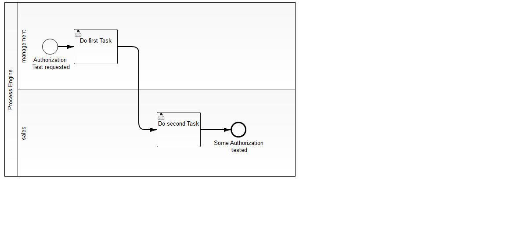

Authorized User Tasks
=========================

In our project people asking for security, how can we assure that only users complete tasks that they are allowed to. This snippet shows how you can get there.

**This snippet is obsolete since camunda BPM 7.3.0. Use** [Authorization Service](http://docs.camunda.org/7.3/guides/user-guide/#process-engine-authorization-service) **instead.**

Show me the important parts!
----------------------------

It is just jUnit-driven, the project consists of a task listener to check if the user is authorized to claim and complete the actual task. In the test you should get an impression how to use and extend it. 

The task listener is created as a process engine plugin.

How does it work?
-----------------

For our simple process with two user tasks in different lanes one new resource 'processDefinitionResource' is used to grant access with two different resource ids to check against later on. 

The resource id is build from the parts ``processDefinitionKey-candidateGroup``, in this example 'authorization-demo-management' and 'authorization-demo-sales'. The new resource is defined as a static member ``AuthorizationResources.resource``.

While setting up the unit test authorizations for the resource are created. The group 'management' is granted the authorization to access and create the resource with the according Id, the group 'sales' is granted to access the same resource with another Id.

A super-user gets all permissions to the process definition resource with all ids to delete during deployment cleanup. To do the cleanup, a new subclass of ProcessEngineRule is used to run the test. The super-user is authenticated before finishing the tests. 
  

How to use it?
--------------

There is no web interface to access the application.
To get started refer to the `InMemoryH2Test`.

You can also use `ant` to build and deploy the example to an application server.
For that to work you need to copy the file `build.properties.example` to `build.properties`
and configure the path to your application server inside it.
Alternatively, you can also copy it to `${user.home}/.camunda/build.properties`
to have a central configuration that works with all projects generated by the
[Camunda BPM Maven Archetypes](http://docs.camunda.org/latest/guides/user-guide/#process-applications-maven-project-templates-archetypes).

Once you deployed the application you can run it using
[Camunda Tasklist](http://docs.camunda.org/latest/guides/user-guide/#tasklist)
and inspect it using
[Camunda Cockpit](http://docs.camunda.org/latest/guides/user-guide/#cockpit).

Environment Restrictions
------------------------

Built and tested against Camunda BPM version 7.1.0-Final.

Known Issues
------------

Improvements Backlog
--------------------

Add the process definition resource to the enumeration of resources in the engine. 
