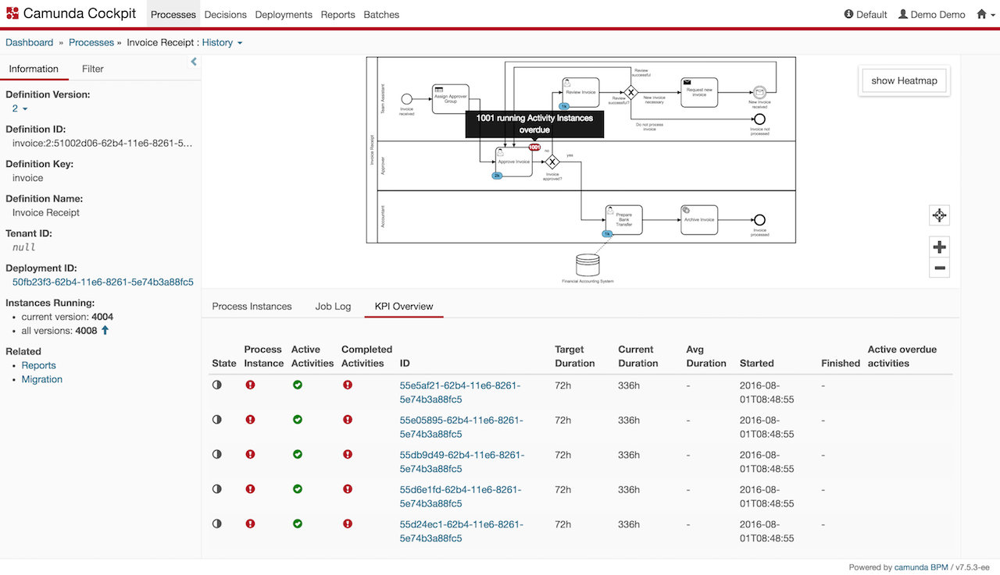

# Cockpit KPI Overview Plugin

## Show me the important parts!
With the help of this Cockpit Plugin one can display KPIs that were defined within the BPMN model using the KPI Element Template provided within this repository.
This plugin integrates into two extension points to show the necessary information:
###Process Definition History Tab
This view registers in 'cockpit.processDefinition.history.tab'.

###Process Instance History Tab
This view registers in 'cockpit.processInstance.history.tab'.

## How does it work?
The basic idea of this plugin is to read the KPI information from the BPMN process definition and show this information in the front-end next to other relevant data that is already saved in the Camunda History Database.
From the architectural point of view the Plugin consists of two parts:
> JavaScript Front-End which uses Angular to register within two pre-defined Camunda Cockpit Entry Points ('cockpit.processDefinition.history.tab' and 'cockpit.processInstance.history.tab'). You can see the basic definition in src/main/resources/plugin-webapp/kpi-overview-plugin/plugin.js.
Within the same folder you can see two Angular Controller and other JS components which are used to call the Back-End and show the necessary information in Front-End.

> Java Back-End which is responsible to provide specific REST endpoints and talking to the Camunda History database.

## How to use it?
> ###Improving this plugin###
For development purposes it is best to run the cockpit plugin inside a standalone Camunda EE.
This is already set up and you can go ahead by using Maven `mvn jetty:run -P develop`

----------

> ###Using the plugin in your cockpit###
You can use `ant` to build and install the plugin to an existing Cockpit inside an application server.
For that to work you need to copy the file `build.properties.example` to `build.properties`
and configure the path to your application server inside it.
Alternatively, you can also copy it to `${user.home}/.camunda/build.properties`
to have a central configuration that works with all projects generated by the
[Camunda BPM Maven Archetypes](http://docs.camunda.org/latest/guides/user-guide/#process-applications-maven-project-templates-archetypes).
Once you installed the plugin it should appear in
[Camunda Cockpit](http://docs.camunda.org/latest/guides/user-guide/#cockpit).

## More information
[How to install a Cockpit plugin](https://docs.camunda.org/manual/latest/examples/tutorials/develop-cockpit-plugin/#integration-into-cockpit)

## Outlook
There are few things that come to my head when I think about the plugin and features that could be of interest in the future:
- Filtering on time frames
- Send reminder emails

## License
Use under terms of the [Apache License, Version 2.0](http://www.apache.org/licenses/LICENSE-2.0)
