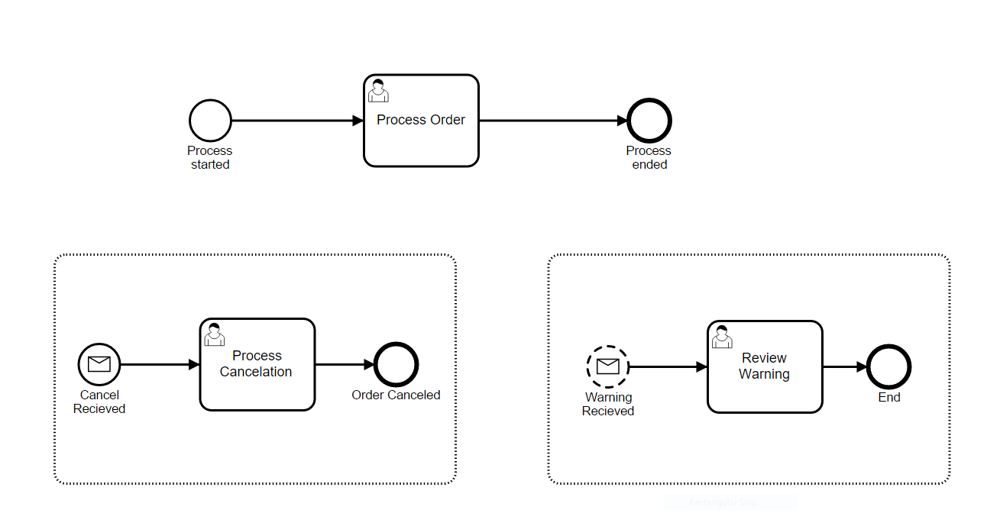

# Event Sub-Process Example
A Process Application for [Camunda BPM](http://docs.camunda.org).

This project has been generated by the Maven archetype
[camunda-archetype-servlet-war-7.4.0](http://docs.camunda.org/latest/guides/user-guide/#process-applications-maven-project-templates-archetypes).

## Show me the important parts!

## How does it work?

###There are two processes in this project
 

1. Wait for Order Process
  * This is a process which starts when a user enters a Customer ID and a Ordered Item. The process then moves onto a user task that simply displays the variables. At any point a user can complete this task to end the process
  * This process also contains two event sub-processes that are started from a message event. One of the event sub-processes is interupting, and is intended to cancel the order. Once a message arrives for it, the process is interupted and a new user task displays the reason for the cancelation as well as the user who canceled the order.
  * The second event subprocess is a non-interupting one. This is intended to send a warning about the order and does not cancel the currently active user task. 

2. Cancel Order Process
  * This is a process which starts when a user enters the Customer ID and Ordered Item of the order they would like to send a message to. They also add a message type (either a warning or a cancelation) and a reason for the message.
  * A service task then uses the data entered to correlate a message with a waiting process. 
  * Correlation is done by sending 4 vatiables 
    * Business Key (customer id)
    * Message Name (either CANCEL_PROCESS or WARNING_MESSAGE)
    * Correlation Key (ordered Item)
    * Variables (the reason and user who canceled the order)

## How to use it?
Download and build with maven and deploy to the Camunda BPM platform. 

You can also use `ant` to build and deploy the example to an application server.
For that to work you need to copy the file `build.properties.example` to `build.properties`
and configure the path to your application server inside it.
Alternatively, you can also copy it to `${user.home}/.camunda/build.properties`
to have a central configuration that works with all projects generated by the
[Camunda BPM Maven Archetypes](http://docs.camunda.org/latest/guides/user-guide/#process-applications-maven-project-templates-archetypes).

Once you deployed the application you can run it using
[Camunda Tasklist](http://docs.camunda.org/latest/guides/user-guide/#tasklist)
and inspect it using
[Camunda Cockpit](http://docs.camunda.org/latest/guides/user-guide/#cockpit).

## Environment Restrictions
Built and tested against Camunda BPM version 7.4.0.

## Known Limitations

## Improvements Backlog

## License
[Apache License, Version 2.0](http://www.apache.org/licenses/LICENSE-2.0).

<!-- HTML snippet for index page
  <tr>
    <td></td>
    <td><a href="snippets/event-subprocess-example">Camunda BPM Process Application</a></td>
    <td>A Process Application for [Camunda BPM](http://docs.camunda.org).</td>
  </tr>
-->
