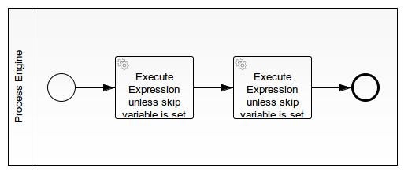

Skip Expressions of Service Tasks based on a Variable
=====================================================

This example shows how to skip the execution of UEL expressions on Service Tasks
based on a process variable.

This is especially useful, if the Service Tasks are asynchronous:
If the first execution succeded to invoke a backend service with a non-transactional side-effect,
but then failed to commit, you can retry the Asynchronous Continuation Job
while skipping the re-invocation of the backend service. 

See also the more advanced example
[Skip User Code of Service Tasks based on a Variable](../skip-delegate-interceptor/),
which uses a DelegateInterceptor and an extension attribute.


Show me the important parts!
----------------------------


Each Service Task has an expression like:
```
${skip.isSetIn(execution) || logger.execute(execution)}
```

If the variable `skipNextExpression` is set in the execution, the expression will not be executed.


How does it work?
-----------------
```java
public class Skip {

	public boolean isSetIn(DelegateExecution execution) {
		if (execution.hasVariableLocal("skipNextExpression")) {
			execution.removeVariableLocal("skipNextExpression");
			return true;
		} else {
			return false;
		}
	}
	
}
```

How to use it?
--------------
In Spring or CDI the Skip class should be registered as a named bean.
In a JUnit test you can do:
```java
Mocks.register("skip", new Skip());
```

Environment Restrictions
------------------------
CDI or Spring

Known Issues
------------
The result of the original expression cannot be stored as a result variable using the according Service Task attribute.

Improvements Backlog
--------------------

