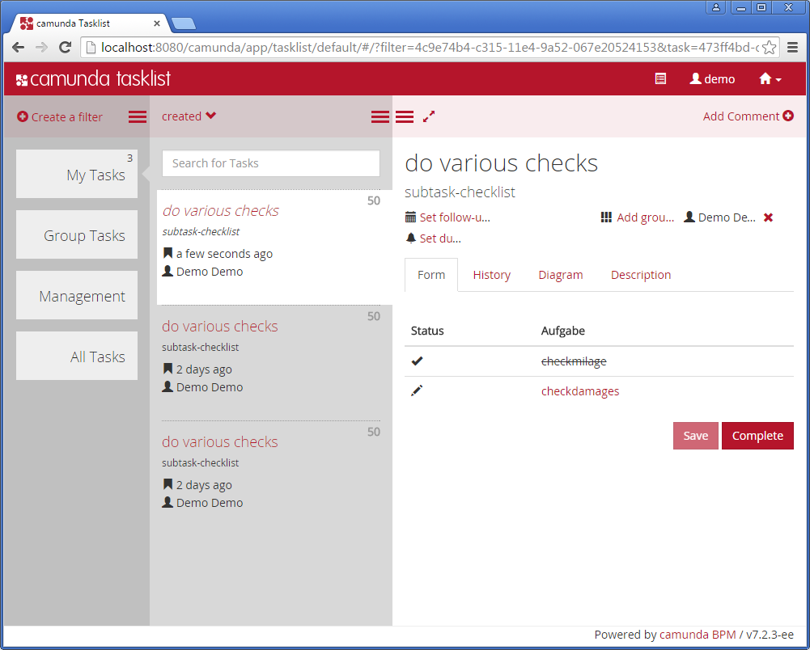

subtask-checklist
=========================

This project shows how to use subtasks within a BPMN UserTask by defining them in the process model (XML). An Extension Element is used and this JSON string configures the subtasks:

<pre><code>
[
    {
        "taskName": "checkmilage",
        "taskFormKey": "myForm.jsf"
    },
    {
        "taskName": "checkdamages",
        "taskFormKey": "myForm.jsf"
    }
]
</code></pre>

This can be directly used within the BPMN process:

```xml
    <bpmn2:userTask id="Task_1" camunda:formKey="embedded:app:task-form.html" name="do various checks">
      <bpmn2:extensionElements>
        <camunda:taskListener class="com.camunda.bpm.demo.subtask_checklist.CreateSubTasksListener" event="create"/>
        <camunda:properties>
          <camunda:property value="[       {           &quot;taskName&quot;: &quot;checkmilage&quot;,           &quot;taskFormKey&quot;: &quot;myForm.jsf&quot;       },       {           &quot;taskName&quot;: &quot;checkdamages&quot;,           &quot;taskFormKey&quot;: &quot;myForm.jsf&quot;       }   ]" name="subtaskConfiguration"/>
        </camunda:properties>
        <camunda:taskListener class="com.camunda.bpm.demo.subtask_checklist.VerifySubtasksEndedListener" event="complete"/>
      </bpmn2:extensionElements>
      <bpmn2:incoming>SequenceFlow_1</bpmn2:incoming>
      <bpmn2:outgoing>SequenceFlow_2</bpmn2:outgoing>
    </bpmn2:userTask>
```

A TaskListener creates the subtask when the UserTask is entered. In the form used to display the task I simply visualized the subtasks as list indicating the status:



A second TaskListener verifies that the UserTask can only be completed if all subtasks are completed - otherwise you get an exception.


Environment Restrictions
------------------------

Built and tested against Camunda BPM version 7.2.0.


License
-------

[Apache License, Version 2.0](http://www.apache.org/licenses/LICENSE-2.0).
